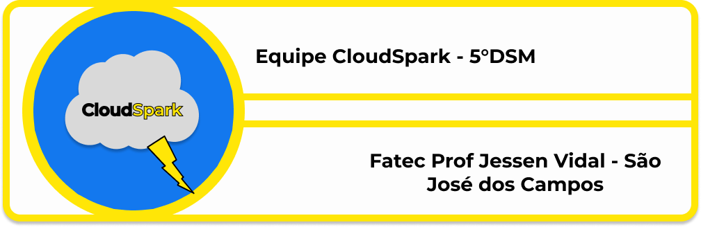

<h1 id="topo" align="center"> 🌩️ CloudSpark 🌩️</h1>

  

 

 
  <a href="#sobre">Sobre</a>  |  
  <a href="#entregas">Entregas</a>  |
  <a href="#backlog">Backlog</a> |
  <a href="#docs da ia">Documentação da IA</a>  |
  <a href="#repositorios"> Repositórios</a> |
  <a href="#tecnologia">Tecnologias</a>  |
  <a href="#equipe">Equipe</a> |

## 🗺️  Sobre o Projeto

As técnicas de sensoriamento remoto óptico orbital enfrentam dificuldades em suas capacidades de imageamento devido, principalmente, à cobertura de nuvens. Tendo isso em mente, nós estabelecemos como objetivo desse projeto criar uma aplicação que seja capaz de analisar uma determinada área de busca de acordo com um período e uma amplitude de interesse e então, aplicar uma máscara gerada automaticamente por uma inteligência artificial, que apresentará os focos com coberturas de nuvens e sombras de nuvens, permitindo também, o donwload destas imagens. Esse sistema contará com disponibilidade para dispositivos móveis, bem como, uma interface web intuitiva para realização das buscas de interesse. Além disso, a aplicação será integrada com uma IA de autoria própria, amplamente treinada e testada.

→ [Voltar ao topo](#topo)

## 🔨 Entregas

| Sprint | Previsão | Status | Relatório da Sprint |
|:--:|:----------:|:------------:|:-------------:|
| 01 | 02/04/2023 | 🚧 Em andamento | [Relatório]() |
| 02 | 23/04/2023 |  🔒 Pendente | - |
| 03 | 14/05/2023 | 🔒 Pendente | - |
| 04 | 04/06/2023 | 🔒 Pendente | - |

→ [Voltar ao topo](#topo)

## Backlog do produto

  
|Sprint | Requisito | status |
|:-----:|:----------:|:-----:|
|  1  | -------- | ✔️ |

→ [Voltar ao topo](#topo)

## 🤖☁️ Documentação da IA

🏗️ ESTE ESPAÇO ESTÁ DESTINADO PARA A DOCUMENTAÇÃO DA IA

→ [Voltar ao topo](#topo)

## 📡 Links para os repositórios

→ [Voltar ao topo](#topo)

## 🛠️ Tecnologias utilizadas

→ [Voltar ao topo](#topo)

## 🧑‍💻 Colaboradores

|    Função     | Nome                                  |                                                                                                                                                      LinkedIn & GitHub                                                                                                                                                      |
| :-----------: | :------------------------------------ | :-------------------------------------------------------------------------------------------------------------------------------------------------------------------------------------------------------------------------------------------------------------------------------------------------------------------------: |
| Product Owner | Caio Vitor Dias |                |
| Scrum Master  | Igor Da Silva Pereira |               |
|   Dev Team    | Valderi Douglas |   |
|   Dev Team    | Augusto Henrique Buin |       |
|   Dev Team    | Felipe Augunsto Graciano |   |
|   Dev Team    | Julio de Paula Machado |   |
|   Dev Team    | Vitor Garcez de Oliveira |   |  Dev Team | Gabriela da Silva Barbosa |  [] ()|

→ [Voltar ao topo](#topo)
